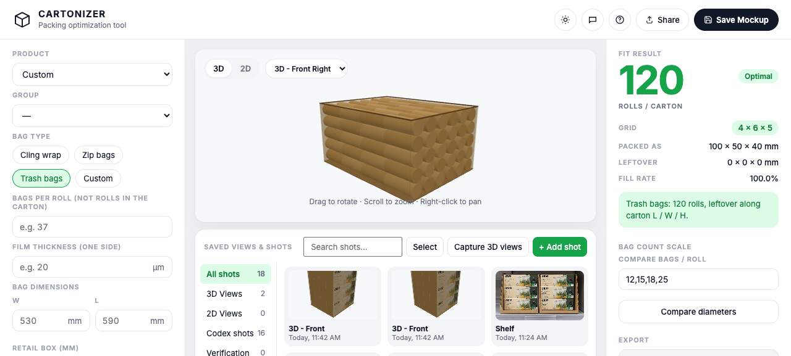
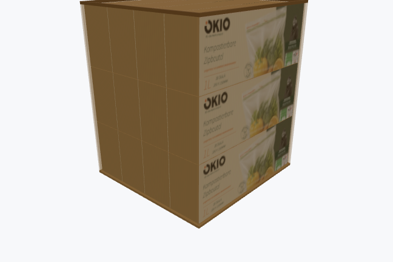

# Cartonizer

Python packing table in the browser. You enter a retail pack in millimetres and a shipping carton inner size. The script tries all six axis-aligned orientations and keeps the densest regular grid: piece count, leftover millimetres, fill percent.

`index.html` draws that pack in Three.js. Camera presets (front, left, top, top-open) sit on the carton axes, so 3D stills and image-model layout refs hit the same faces.

If you load front, back, and side print, Codex shots (GPT Image through `codex login`) can render the carton closed, as an open shipper, side-open, or on a shelf. Skip the print and it invents the artwork. I would not hit that button until the print is on the table.

Saved views & shots is the gallery. It follows the Product dropdown, so SKUs do not dump into one pile.

Export sheet downloads a reverse-tuck SVG of the retail box from the millimetres. No model, no login. Shape has to be Box.

The GitHub copy is the empty tool. Mockups, wraps, quotes, and generated files stay on your machine.



## Run

```bash
python3 serve.py
```

Open [http://127.0.0.1:8765/](http://127.0.0.1:8765/).

Grok chat needs `grok login`. Codex shots need `codex login`. Auth lives in `~/.grok/auth.json` and `~/.codex/auth.json`, not in this repo.

The 3D pack-out also opens as a static file if you just want the math view.

## Workflow

Put millimetres on the table. The 3D view is the pack-out.

Capture 3D views if you want stills of that model, or a layout frame for Codex.



The Codex button copies the loaded print onto photoreal carton photos. Same print, different cameras.


Those two are sample GPT Image output. The print files are not in the repo.

The library only shows shots for the selected product. Chat sits behind the header icon and replaces the library when you open it.

## What is public vs local

| Public | Stays on your machine (gitignored) |
|---|---|
| `serve.py`, `index.html` | `mockups/` saved designs and wraps |
| `factory/SCHEMA.json` | `factory/catalog.json`, quotes, variants |
| `docs/screenshots/` | `runtime/` generated shots and 3D captures |
| this README | `examples/` |

Saving a mockup in the UI writes into those local folders.

## Packing rule

Axis-aligned orthogonal grid only. Every unit uses the same winning orientation. Inner carton L × W × H in millimetres. No stagger, mixed orientations, or pallet load.

## License

Use as you like for your own packing studies.
